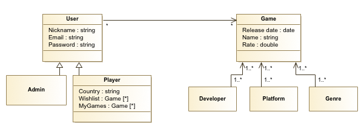
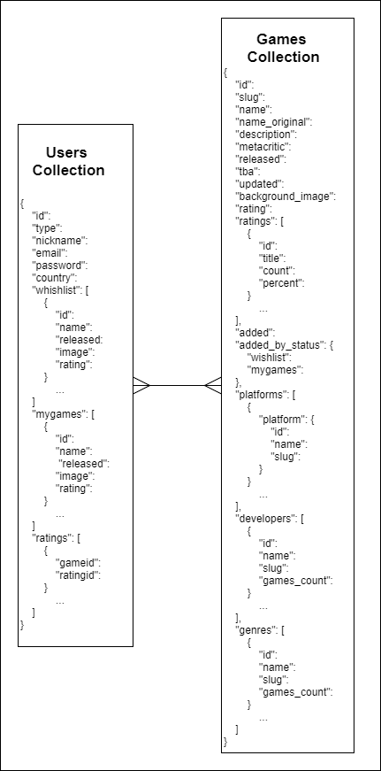
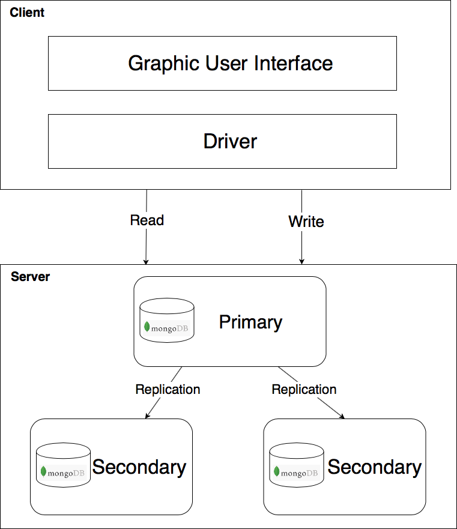

# Workgroup task 2 - Design document

## Table of contents
1) [Introduction](#1-introduction)
2) [Actors of the System](#2-actors-of-the-system)
3) [Functional Requirements](#3-functional-requirements)
4) [Non-Functional Requirements](#4-non-functional-requirements)
5) [Use Cases Diagram](#5-use-cases-diagram)
6) [Analysis Classes Diagram](#6-analysis-classes-diagram)
7) [Data Model](#7-data-model)
8) [Software Architecture](#8-software-architecture)

## 1. Introduction

GIAR (Games information and Ratings) is an application that collects information and ratings about videogames.

A user needs an account to access the platform. If a user already has an account, he will insert his Email and Password to access. Otherwise, he has to fill a form composed by Nickname, Email, Password and Country to create a new account. 

After the log-in the user is redirected to the homepage.

A user can search a game by name using the search bar on the top of the homepage.

A user can browse a list of games choosing one of these filters: platform, year or genre. The user can sort the list of the games by date, name or rating. A user can browse the top rated games per platform.

A user can access a specific page for every game that contains all the information about it and on which a user can rate the game.

A user has two personal lists: MyGames and WishList. The first is referred to the games that the user has bought, the second is a list of games that the user want to buy in the future. The user can add a game in one of these lists from the specific page of the game, and delete one game from a list accessing to the relative section.

Administrator is a special user who can insert, modify and delete games from the system. Administrator doesn't have the possibility to rate a game or have a list of personal games.

Administrator can also see information about users' games preferences grouped by country and how many users added a game in the Wishlists or in MyGames lists.

## 2. Actors of the system

The system actors are divided in two kinds of users:
- `Administrator`: Users who are responsible for managing the system.
- `Player`: Users who want to use the system to search, rate and discover new games.

## 3. Functional requirements

This section defines the services that the system provides to the users. To every functional requirement is assigned a unique key `FNC-nnn` where *nnn* is a sequence number identifying the functional requirement. The following table lists all the functional requirements:

Functional Requirement | Description
------------ | -------------
FNC-001 | A `player` shall be able to login into the system if he has an account, otherwise he shall be able to register into the system. 
FNC-002 | Each user email shall be associated up to one account. 
FNC-003 | A `player` shall be able to delete his account.
FNC-004 | The user nickname shall be unique.
FNC-005 | A user shall be able to search a game using a search bar.
FNC-006 | A `player` shall be able to browse a list of videogames previews choosing a year, platform or genre filter, and sort them by date, name or rating.
FNC-007 | A user shall be able to see all the information regarding a videogame, in a dedicated page, clicking on the corresponding preview.
FNC-008 | The system shall provide to the user the rate for a videogame both from a specialized entity and from the average users' rate.
FNC-009 | The `player` shall be able to see statistics regarding the top games per platform. 
FNC-010 | The `player` shall be able to rate a videogame or change his previous rating.
FNC-011 | The `player` user shall be able to add and remove a game from the MyGames list.
FNC-012 | The `player` user shall be able to add and remove a game from the Wishlist.
FNC-013 | A game shall not be in a `player` Wishlist and MyGames list at the same time. 
FNC-014 | The `administrator` shall be able to insert, modify and delete games from the system.
FNC-015 | The `administrator` shall be able to see statistics about the distribution of the most added games in the MyGames list grouped by country.
FNC-016 | The `administrator` shall be able to see statistics regarding how many users added a game in the Wishlists or Mygames lists.
FNC-017 | The user shall be able to see the version of the data updated to his last interaction.

## 4. Non-functional requirements

Non-functional requirements describe only attributes of the system or attributes of the system environment. To every non-functional requirement is assigned a unique key `XX-nnn` where *XX* identifies the type of requirement (example: *AVA* for *AVAILABILITY*) and *nnn* is a sequence number identifying the non-functional requirement.

### 4.1 Availability
Availability Requirement | Description
------------ | -------------
AVA-001 | The system shall be always available.
AVA-002 | The system shall be tolerant to data lost using an original dataset and two replicas.

### 4.2 Reliability
Reliability Requirement | Description
------------ | -------------
REL-001 | The system must give stable and reproducible results.

### 4.3 Usability
Usability Requirement | Description
------------ | -------------
USA-001 | The application shall be user-friendly, since a user shall interact with an intuitive graphical interface.

### 4.4 Scalability
Scalability Requirement | Description
------------ | -------------
SCA-001 | The system shall work on a non-prefixed number of cluster nodes.

### 4.5 Portability
Portability Requirement | Description
------------ | -------------
POR-001 | The system shall be not environment dependent, since shall run on different operating systems.

### 4.6 Maintainability 
Maintainability Requirement | Description
------------ | -------------
MAN-001 | The code shall be readable and easy to maintain.

### 4.7 Security
Security Requirement | Description
------------ | -------------
SEC-001 | The system shall store the passwords encrypted.

## 5. Use Cases Diagram
In the first schema there is the Use Case diagram for the player side, in the second schema there is the admin side of the diagram.

## 6. Analysis Classes Diagram

## 7. Data Model

The database will be composed by two collections, the `users` collection and the `games` collection.
The Developers, Genres and Platforms documents are always called together with the Game documents, so they are embedded.
In the User documents, the MyGames, the Wishlist and Ratings are embedded documents that contains key infomation about games.

## 8. Software Architecture

The application is a client-server application. The client provide to the user the interface for interacting with the database. On the server side there is a document database. The document database is a MongoDB server which is composed by an original dataset and two replicas.

